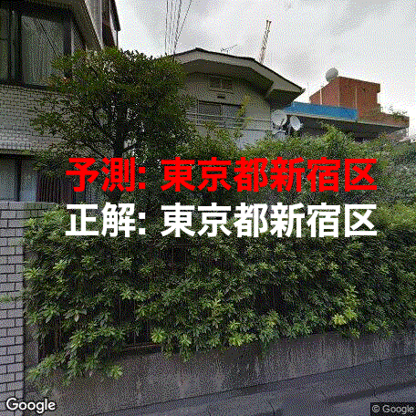

[](https://share.streamlit.io/hi-king/tokyo_photo2geo/main/scripts/web.py)

# tokyo_photo2geo

Predict where the photo was taken from single shot image



# Predict your photo

```
poetry install
poetry run python scripts/predict.py ${your_image_path}
```

or

notebooks/predict.ipynb

# Create your own model

```python
poetry install
KEY=XXXXXX poetry run python scripts/create_dataset.py
poetry run python scripts/train.py \
    --model resnet50 \
    --batch_size 30 \
    --lr 0.00001 \
    --weight_decay 0 \
    --epoch 200
```

# References

- [機械学習で逆ストリートビューを作り、写真から港区らしさを判定する](https://www.m3tech.blog/entry/photo2geo)
